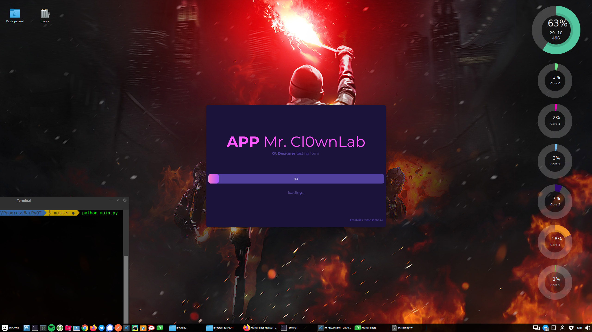
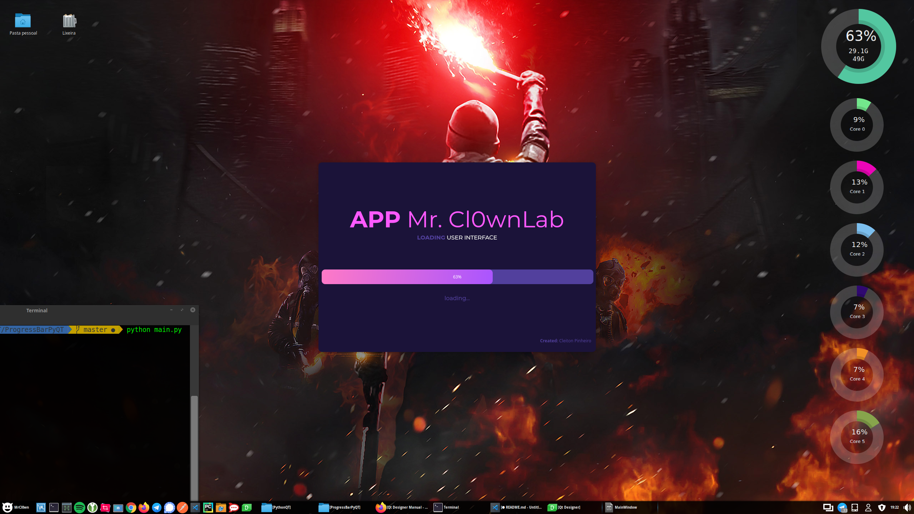
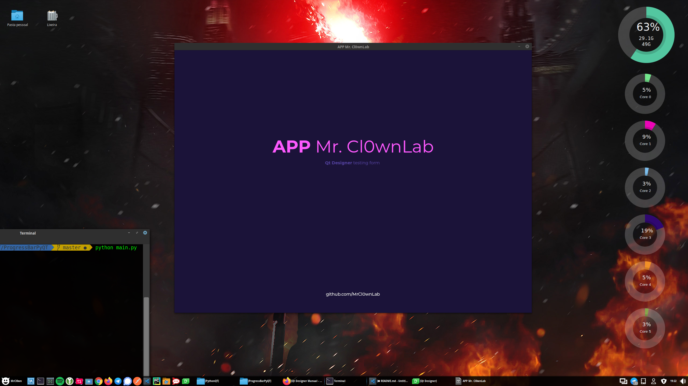

# ProgressBarPyQT / Splash Screen

[](https://www.python.org/)
[]()
[]()

--
This is the study of an interface with PyQT /
Python - Splash Screen - Modern Gui [Qt Designer, PySide2/PyQt5] 

## Using Qt Designer
Qt Designer is the Qt tool for designing and building graphical user interfaces (GUIs) with Qt Widgets. You can compose and customize your windows or dialogs in a what-you-see-is-what-you-get (WYSIWYG) manner, and test them using different styles and resolutions.


Qt Designer: https://doc.qt.io/qt-5/qtdesigner-manual.html

## Prints form:
```
$ python main.py
```
####  Process Splash

####  Process Splash

####  Form Main


### My study reference
Python - Splash Screen - Modern Gui [Qt Designer, PySide2/PyQt5] (Time Lapse Video)
- https://www.youtube.com/watch?v=Ap865V3sAdw
- https://github.com/Wanderson-Magalhaes/Splash_Screen_Python_PySide2
